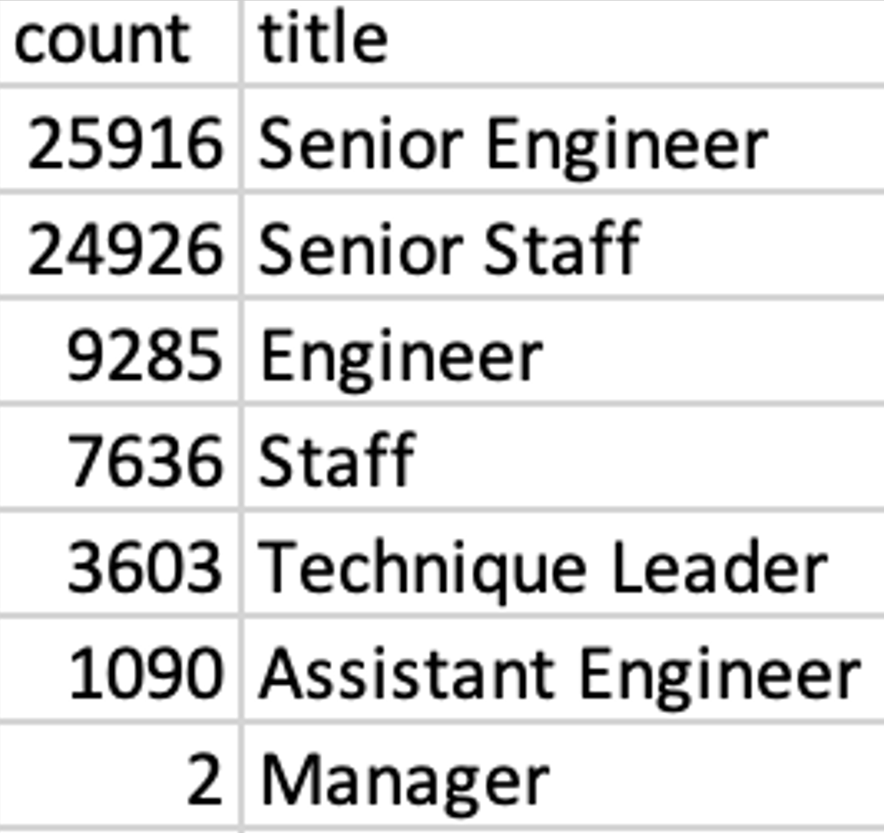
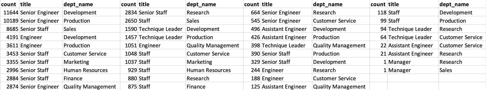
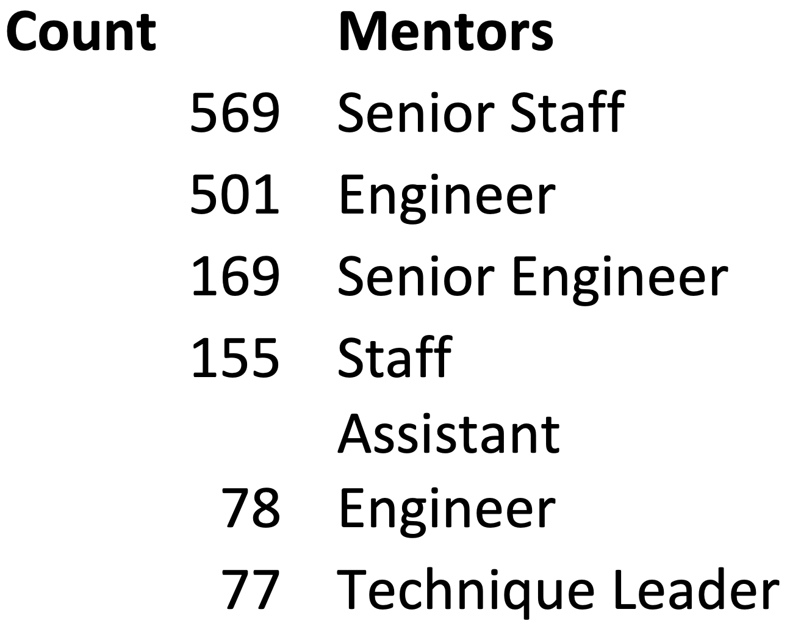
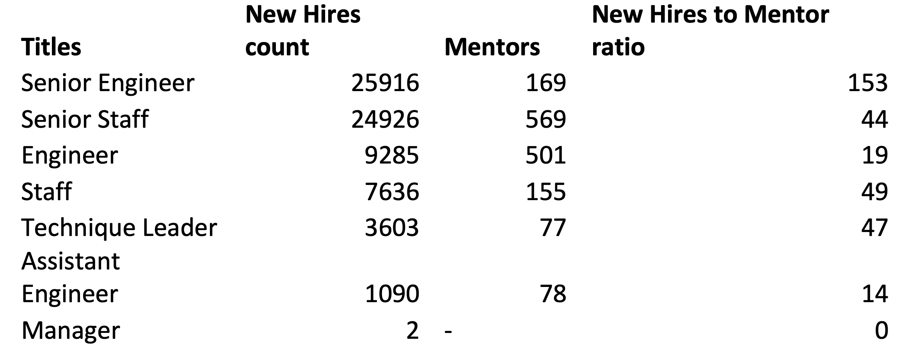

# **sql hallenge**

## **Overview:**

A number of employees from Pewlett Hackard are reaching retirement age. Therefore, the goal of this analysis is to first determine employees reaching retirement age, their job title and department. Based on the upcoming job vacancies, an action plan to hire new employees should be in effect to prevent operational failure. The new employees should have mentors to bring them up to speed to initialize them to the hired position to maximize operational efficiency. Hence the number of current employees available for mentorship for new hires is also determined.

The following four important conclusions were reached.

## **1.	Job postings categorized based on urgency:**

  Based on number of retirees per title the urgency of filing a particular job title is categorized into three
-	High demand (vacancies between 10,000 -20,000)
- Moderate demand (vacancies between 5,000-9,999)
- Low demand (vacancies between 1-4,999)

Based on this categorization, Senior engineers (25,916), and senior staff (24,926) are on high demand and require immediate attention to prevent operational failure. The moderate demand include Engineer (9285), staff(7636) and the low demand include Technique Leader(3603), Assistant Engineer(1090) and manager (2).

## **2 Job vacancy by Department:**

The above analysis yields the total count of a particular job title, but it does not say much about which department the vacancy is available. A different query was designed to obtain the job vacancies based on departments (table below) and this a more realistic picture of which department has the highest number of job openings. As per this query the top 5 job titles by the departments are:

-	Senior engineers – Development 
- Senior engineers – Production
- Senior Staff – Sales
- Engineer – Development
- Engineer - Production

## **3.Total Mentor Count:**

Since a lot of employees are of retirement age, it is important that the company has enough senior mentors to bring the new hires up to speed to maximize operational efficiency. A query was designed to determine the number of eligible mentors by title for every job title as shown in the following table. 

## **4.New Hires to Mentors ratio:**

The number of mentors available may not be enough for a one-on-one mentorship based on the new hires to mentor ratio as shown in the table below and demands conducting large workshops to bring the new hires to speed.

